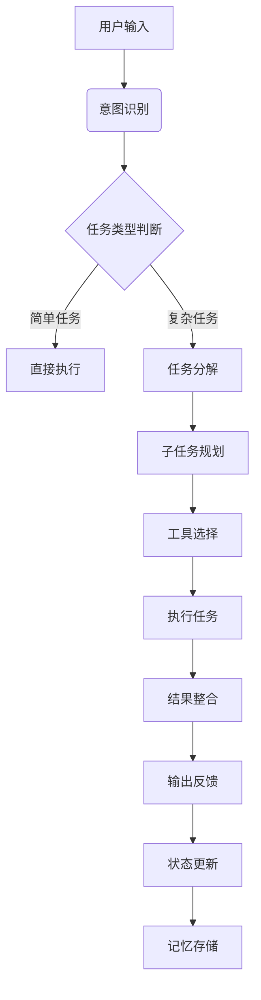

# Session: 2026-04-03 00:46:36 UTC

- **Session Key**: agent:main:feishu:direct:ou_b3e9d506fffc28a72258bf51a107031d
- **Session ID**: f1e4a848-ae8e-4566-b093-0461b6b58bad
- **Source**: feishu

## Conversation Summary

user: A new session was started via /new or /reset. Run your Session Startup sequence - read the required files before responding to the user. Then greet the user in your configured persona, if one is provided. Be yourself - use your defined voice, mannerisms, and mood. Keep it to 1-3 sentences and ask what they want to do. If the runtime model differs from default_model in the system prompt, mention the default model. Do not mention internal steps, files, tools, or reasoning.
Current time: Friday, April 3rd, 2026 — 6:20 AM (Asia/Shanghai) / 2026-04-02 22:20 UTC
assistant: I've read the required files and am ready to help. 

你好，饲养员！我是狗蛋，你的AI助手。今天有什么需要我帮忙的吗？ 

当前时间：2026年4月3日 早上6:20（北京时间）🐕
user: Conversation info (untrusted metadata):
```json
{
  "message_id": "om_x100b53daf420d8a4b364b99133f1173",
  "sender_id": "ou_b3e9d506fffc28a72258bf51a107031d",
  "sender": "用户493490",
  "timestamp": "Fri 2026-04-03 06:20 GMT+8"
}
```

Sender (untrusted metadata):
```json
{
  "label": "用户493490 (ou_b3e9d506fffc28a72258bf51a107031d)",
  "id": "ou_b3e9d506fffc28a72258bf51a107031d",
  "name": "用户493490"
}
```

[message_id: om_x100b53daf420d8a4b364b99133f1173]
用户493490: 天气预报
assistant: 根据天气预报信息，上海未来几天天气情况如下：

🌧️ **近期天气特点**：
- 南方地区将持续阴雨天气，上海也不例外
- 气温相对稳定，维持在12-17℃之间

📅 **未来几天预报**：
- **4月3日（今天）**：雨转阴，18/10℃，微风
- **4月4日**：雨，18/11℃，微风  
- **4月5日**：小雨转阴，17/11℃，微风

⚠️ **温馨提示**：
- 连续降雨天气，出行记得携带雨具
- 气温偏低，注意保暖
- 雨天路滑，注意交通安全

需要了解具体某天的详细天气情况吗？🐕
user: Conversation info (untrusted metadata):
```json
{
  "message_id": "om_x100b53daf26a24a4b3d8f25e55a2959",
  "sender_id": "ou_b3e9d506fffc28a72258bf51a107031d",
  "sender": "用户493490",
  "timestamp": "Fri 2026-04-03 06:20 GMT+8"
}
```

Sender (untrusted metadata):
```json
{
  "label": "用户493490 (ou_b3e9d506fffc28a72258bf51a107031d)",
  "id": "ou_b3e9d506fffc28a72258bf51a107031d",
  "name": "用户493490"
}
```

[message_id: om_x100b53daf26a24a4b3d8f25e55a2959]
用户493490: 北京
assistant: 根据天气预报信息，北京今天（4月3日）的天气情况如下：

🌤️ **今天天气**：
- **白天**：晴，西北风，微风，最高温度21℃
- **夜间**：多云，北风，微风，最低温度8℃

📊 **天气特点**：
- 白天阳光充足，适合户外活动
- 昼夜温差较大（13℃），注意及时增减衣物
- 风力较小，空气质量应该不错

💡 **出行建议**：
- 白天温度适宜，可以穿春装外出
- 晚上温度较低，建议添件外套
- 天气晴朗，紫外线可能较强，注意防晒

需要了解北京未来几天的天气预报吗？🐕
user: Conversation info (untrusted metadata):
```json
{
  "message_id": "om_x100b53c415dae0a0b2fe8ee7d285fd1",
  "sender_id": "ou_b3e9d506fffc28a72258bf51a107031d",
  "sender": "用户493490",
  "timestamp": "Fri 2026-04-03 08:11 GMT+8"
}
```

Sender (untrusted metadata):
```json
{
  "label": "用户493490 (ou_b3e9d506fffc28a72258bf51a107031d)",
  "id": "ou_b3e9d506fffc28a72258bf51a107031d",
  "name": "用户493490"
}
```

[message_id: om_x100b53c415dae0a0b2fe8ee7d285fd1]
用户493490: 我想再做一个 agent，也是是说和狗蛋一样的 agent，给我些si l 思路
assistant: 我来帮你设计一个新的AI agent！让我先搜索一下相关的思路和
assistant: 基于搜索结果，我为你提供一个完整的AI Agent设计思路。既然你已经有了"狗蛋"这个agent，我们可以设计一个不同定位的新agent。

## 🤖 新Agent设计思路

### 🎯 定位差异化
既然"狗蛋"是生活助手型，我们可以设计一个：
- **专业工作型Agent**：专注于工作效率、项目管理、数据分析
- **创意型Agent**：专注于内容创作、设计思维、艺术创作
- **学习型Agent**：专注于知识管理、学习辅导、技能提升

### 🏗️ 核心架构（基于MCP架构）

#### 1. **Memory（记忆模块）**
- **短期记忆**：当前会话上下文
- **长期记忆**：用户偏好、历史任务、知识库
- **工作记忆**：当前任务状态、执行历史

#### 2. **Controller（控制器）**
- **意图识别**：理解用户真实需求
- **任务路由**：决定调用哪个子模块
- **状态管理**：跟踪任务执行状态
- **错误处理**：异常情况下的恢复机制

#### 3. **Planner（规划器）**
- **任务分解**：将复杂任务拆解为子任务
- **优先级排序**：确定执行顺序
- **资源分配**：选择合适的工具和模块
- **进度跟踪**：监控任务完成情况

### 🛠️ 功能模块设计

#### 基础能力层
```
├── 语言理解模块
│   ├── 意图识别
│   ├── 实体提取
│   └── 情感分析
├── 知识管理模块
│   ├── 知识库检索
│   ├── 文档处理
│   └── 信息提取
├── 工具调用模块
│   ├── API集成
│   ├── 文件操作
│   └── 网络请求
└── 输出生成模块
    ├── 文本生成
    ├── 代码生成
    └── 多媒体生成
```

#### 专业能力层（根据定位选择）
```
专业工作型：
├── 项目管理
├── 数据分析
├── 报告生成
└── 会议助手

创意型：
├── 文案创作
├── 设计建议
├── 创意发散
└── 艺术生成

学习型：
├── 知识梳理
├── 学习计划
├── 练习生成
└── 进度跟踪
```

### 🔄 工作流程



### 🎨 个性设计建议

#### 性格特征
- **专业型**：严谨、高效、逻辑性强
- **创意型**：活泼、开放、富有想象力
- **学习型**：耐心、细致、鼓励性强

#### 交互风格
- **专业型**：简洁明了，数据驱动
- **创意型**：富有表现力，视觉化强
- **学习型**：循序渐进，鼓励式交流

### 🚀 技术实现路径

1. **MVP版本**（最小可行产品）
   - 基础对话能力
   - 简单工具调用
   - 基本记忆功能

2. **进阶版本**
   - 复杂任务处理
   - 多工具协同
   - 个性化学习

3. **完整版本**
   - 自主决策能力
   - 多模态交互
   - 持续学习进化

### 💡 特色功能建议

1. **情境感知**：根据时间、地点、用户状态调整行为
2. **主动建议**：基于用户习惯主动提供帮助
3. **协作模式**：与其他agent或人类协同工作
4. **自我优化**：根据反馈持续改进表现

你觉得这个设计思路如何？有什么特别想要的功能或定位吗？我们可以进一步细化具体的设计方案。🐕
user: Conversation info (untrusted metadata):
```json
{
  "message_id": "om_x100b53c42dbaa4a8b21ce35f520ae9a",
  "sender_id": "ou_b3e9d506fffc28a72258bf51a107031d",
  "sender": "用户493490",
  "timestamp": "Fri 2026-04-03 08:13 GMT+8"
}
```

Sender (untrusted metadata):
```json
{
  "label": "用户493490 (ou_b3e9d506fffc28a72258bf51a107031d)",
  "id": "ou_b3e9d506fffc28a72258bf51a107031d",
  "name": "用户493490"
}
```

[message_id: om_x100b53c42dbaa4a8b21ce35f520ae9a]
用户493490: 如何创建，有教程吗
assistant: 基于搜索结果，我为你整理了一个完整的AI Agent创建教程：

## 🚀 AI Agent 创建完整教程

### 📚 推荐学习资源

#### 1. **菜鸟教程 - AI Agent教程** ⭐⭐⭐⭐⭐
- **链接**: https://www.runoob.com/ai-agent/ai-agent-tutorial.html
- **特点**: 最全面的中文教程，包含理论+实践
- **内容**: 从基础概念到完整实现，包含OpenClaw、LangChain等框架

#### 2. **稀土掘金 - 30分钟入门指南** ⭐⭐⭐⭐
- **链接**: https://juejin.cn/post/7616717720508858374
- **特点**: 快速上手，50行代码实现
- **内容**: 实战导向，包含常见坑点和解决方案

#### 3. **飞书文档 - 构建方法论** ⭐⭐⭐⭐
- **链接**: https://docs.feishu.cn/v/wiki/OOSKwV2ViiVtIjkOnNUcC374nqe/a3
- **特点**: 企业级应用思路
- **内容**: 从需求分析到落地部署的完整流程

### 🛠️ 创建步骤详解

#### **第一步：环境准备**
```bash
# 1. 创建虚拟环境
python -m venv agent_env
source agent_env/bin/activate  # Linux/Mac
# 或 agent_env\Scripts\activate  # Windows

# 2. 安装必要依赖
pip install langchain openai python-dotenv requests
```

#### **第二步：基础架构搭建**
```python
from langchain.agents import initialize_agent, Tool
from langchain.llms import OpenAI
from langchain.chains import LLMChain
from langchain.prompts import PromptTemplate

class SimpleAgent:
    def __init__(self):
        # 1. 初始化大语言模型
        self.llm = OpenAI(temperature=0.7)
        
        # 2. 定义工具集
        self.tools = [
            Tool(
                name="get_weather",
                func=self.get_weather,
                description="获取天气信息的工具"
            ),
            Tool(
                name="calculator", 
                func=self.calculator,
                description="数学计算工具"
            )
        ]
        
        # 3. 初始化Agent
        self.agent = initialize_agent(
            self.tools,
            self.llm,
            agent="zero-shot-react-description",
            verbose=True
        )
        
        # 4. 记忆系统
        self.memory = []
    
    def get_weather(self, city):
        # 调用天气API
        return f"{city}天气：晴天，20°C"
    
    def calculator(self, expression):
        # 简单计算器
        return eval(expression)
    
    def run(self, user_input):
        # 执行用户指令
        result = self.agent.run(user_input)
        self.memory.append({"input": user_input, "output": result})
        return result
```

#### **第三步：进阶功能添加**

##### 1. **添加长期记忆**
```python
import json
from datetime import datetime

class AdvancedAgent(SimpleAgent):
    def __init__(self):
        super().__init__()
        self.long_term_memory = self.load_memory()
    
    def load_memory(self):
        try:
            with open('agent_memory.json', 'r') as f:
                return json.load(f)
        except FileNotFoundError:
            return {"preferences": {}, "history": []}
    
    def save_memory(self):
        with open('agent_memory.json', 'w') as f:
            json.dump(self.long_term_memory, f, indent=2)
    
    def update_preference(self, key, value):
        self.long_term_memory["preferences"][key] = value
        self.save_memory()
```

##### 2. **添加任务规划能力**
```python
class PlanningAgent(AdvancedAgent):
    def plan_task(self, user_input):
        # 任务分解模板
        planning_prompt = PromptTemplate(
            input_variables=["task"],
            template="""
            请将以下任务分解为具体的子任务步骤：
            任务：{task}
            
            请按以下格式输出：
            1. 第一步：...
            2. 第二步：...
            3. 第三步：...
            """
        )
        
        chain = LLMChain(llm=self.llm, prompt=planning_prompt)
        plan = chain.run(user_input)
        return plan.split('\n')
    
    def execute_plan(self, plan_steps):
        results = []
        for step in plan_steps:
            if step.strip():
                result = self.run(step)
                results.append(result)
        return results
```

#### **第四步：个性化定制**

##### 1. **人设设定**
```python
class PersonalityAgent(PlanningAgent):
    def __init__(self, personality="专业助手"):
        super().__init__()
        self.personality = personality
        self.personality_prompt = self.get_personality_prompt()
    
    def get_personality_prompt(self):
        personalities = {
            "专业助手": "你是一个专业的AI助手，回答要简洁、准确、有条理。",
            "创意伙伴": "你是一个富有创意的AI伙伴，善于发散思维，提供新颖的想法。",
            "学习导师": "你是一个耐心的学习导师，善于解释概念，鼓励学习者。"
        }
        return personalities.get(self.personality, personalities["专业助手"])
```

##### 2. **领域 specialization**
```python
class DomainExpertAgent(PersonalityAgent):
    def __init__(self, domain="general"):
        super().__init__()
        self.domain = domain
        self.knowledge_base = self.load_domain_knowledge()
    
    def load_domain_knowledge(self):
        # 加载领域知识
        domains = {
            "programming": "编程知识库...",
            "marketing": "营销知识库...",
            "design": "设计知识库..."
        }
        return domains.get(self.domain, "")
```

### 🎯 快速实践建议

#### **方案1：基于现有框架（推荐新手）**
1. **OpenClaw** - 最适合你的需求，因为"狗蛋"就是基于这个
2. **LangChain** - 最流行的AI Agent框架
3. **CrewAI** - 专注于多Agent协作

#### **方案2：从零开始（适合学习）**
1. 先实现基础对话功能
2. 添加工具调用能力
3. 实现记忆系统
4. 加入任务规划
5. 个性化定制

### 📈 学习路径建议

1. **第1周**：学习基础理论 + 跑通第一个demo
2. **第2周**：理解核心组件 + 实现基础Agent
3. **第3周**：添加进阶功能 + 个性化定制
4. **第4周**：优化性能 + 部署上线

### 💡 实用建议

1. **从简单开始**：先实现核心功能，再逐步添加特性
2. **重视调试**：Agent的决策过程要可追踪
3. **用户反馈**：收集用户反馈持续优化
4. **安全考虑**：添加适当的限制和安全检查

你想从哪个方案开始？我可以帮你一步步实现！🐕
user: Conversation info (untrusted metadata):
```json
{
  "message_id": "om_x100b53c4202088a4b1096619b673201",
  "sender_id": "ou_b3e9d506fffc28a72258bf51a107031d",
  "sender": "用户493490",
  "timestamp": "Fri 2026-04-03 08:16 GMT+8"
}
```

Sender (untrusted metadata):
```json
{
  "label": "用户493490 (ou_b3e9d506fffc28a72258bf51a107031d)",
  "id": "ou_b3e9d506fffc28a72258bf51a107031d",
  "name": "用户493490"
}
```

[message_id: om_x100b53c4202088a4b1096619b673201]
用户493490: 不是，我的意思是如何横向扩展 openclaw 变为多 agent
assistant: 太好了！我找到了OpenClaw多Agent扩展的详细资料。让我为你整理一个完整的横向扩展方案：

## 🚀 OpenClaw 多Agent横向扩展完整指南

### 🏗️ 核心架构设计

#### **1. 基础架构原理**
```
单Gateway → 多Agent架构：
┌─────────────────┐
│   Gateway       │
│   (统一入口)     │
└─────────┬───────┘
          │
    ┌─────┼─────┐
    │     │     │
┌───▼──┐ ┌▼───┐ ┌▼───┐
│Agent1│ │Agent2│ │Agent3│
│main  │ │code  │ │news  │
└──────┘ └──────┘ └──────┘
```

### 📁 文件结构扩展

#### **Agent配置目录结构**
```
~/.openclaw/
├── agents/
│   ├── main/           # 主调度Agent
│   │   ├── agent/      # Agent躯壳(工程配置)
│   │   └── workspace/  # 工作空间(灵魂配置)
│   ├── code-agent/     # 代码Agent
│   │   ├── agent/
│   │   └── workspace/
│   └── news-agent/     # 新闻Agent
│       ├── agent/
│       └── workspace/
└── workspace/          # 默认工作空间
```

### 🔧 具体实施步骤

#### **第一步：创建新的Agent目录**
```bash
# 创建Agent工作目录
mkdir -p ~/.openclaw/agents/code-agent/agent
mkdir -p ~/.openclaw/agents/code-agent/workspace
mkdir -p ~/.openclaw/agents/news-agent/agent  
mkdir -p ~/.openclaw/agents/news-agent/workspace

# 复制基础配置
cp -r ~/.openclaw/agent/* ~/.openclaw/agents/code-agent/agent/
cp -r ~/.openclaw/agent/* ~/.openclaw/agents/news-agent/agent/
```

#### **第二步：配置Agent身份和灵魂**

##### **1. 代码Agent配置**
```markdown
# ~/.openclaw/agents/code-agent/workspace/IDENTITY.md
# IDENTITY.md - 代码专家

- **Name:** 代码助手
- **Creature:** AI编程专家
- **Vibe:** 专业、严谨、逻辑性强
- **Emoji:** 💻
```

```markdown
# ~/.openclaw/agents/code-agent/workspace/SOUL.md
# SOUL.md - 代码专家的灵魂

## 基本信息
- **我的名字**: 代码助手
- **你的名字**: 开发者
- **沟通风格**: 专业、准确、提供最佳实践

## 核心原则
1. **代码质量优先**: 注重代码的可读性、可维护性
2. **安全第一**: 避免潜在的安全风险
3. **性能优化**: 考虑代码的执行效率
4. **最佳实践**: 遵循行业标准和最佳实践
```

##### **2. 新闻Agent配置**
```markdown
# ~/.openclaw/agents/news-agent/workspace/IDENTITY.md
# IDENTITY.md - 新闻资讯助手

- **Name:** 新闻助手
- **Creature:** AI资讯专家
- **Vibe:** 敏锐、及时、客观
- **Emoji:** 📰
```

```markdown
# ~/.openclaw/agents/news-agent/workspace/SOUL.md
# SOUL.md - 新闻助手的灵魂

## 基本信息
- **我的名字**: 新闻助手
- **你的名字**: 用户
- **沟通风格**: 客观、及时、信息丰富

## 核心原则
1. **信息准确性**: 确保信息来源可靠
2. **时效性**: 提供最新、最及时的资讯
3. **客观性**: 保持中立，避免偏见
4. **实用性**: 筛选对用户有价值的信息
```

#### **第三步：配置Agent协作规则**

##### **主Agent的AGENTS.md配置**
```markdown
# ~/.openclaw/workspace/AGENTS.md

## 🤖 多Agent协作系统

### 📋 团队职责分配
| 任务类型 | 负责Agent | 调用方式 |
|---------|-----------|----------|
| 代码开发/审查 | code-agent | `sessions_send(agentId="code-agent", task="...")` |
| 资讯收集/分析 | news-agent | `sessions_send(agentId="news-agent", task="...")` |
| 任务调度/协调 | main | 主调度器 |

### 🔄 协作流程
1. 用户向main agent提出需求
2. main agent分析任务类型
3. 根据任务类型路由到专业agent
4. 专业agent处理并返回结果
5. main agent整合结果反馈给用户

### 🚦 通讯白名单
- main agent可以调用所有agent
- code-agent和news-agent只能接收main agent的指令
```

#### **第四步：配置权限和安全控制**

##### **Agent权限配置文件**
```json
// ~/.openclaw/agents/code-agent/agent/config.json
{
  "capabilities": {
    "allow": ["code-generation", "file-operations", "shell-commands"],
    "deny": ["network-access", "system-admin"]
  },
  "communication": {
    "allow": ["main"],
    "deny": ["news-agent"]
  }
}
```

```json
// ~/.openclaw/agents/news-agent/agent/config.json
{
  "capabilities": {
    "allow": ["web-search", "content-analysis"],
    "deny": ["file-operations", "shell-commands", "system-admin"]
  },
  "communication": {
    "allow": ["main"],
    "deny": ["code-agent"]
  }
}
```

### 🎯 使用示例

#### **场景1：代码开发任务**
```python
# 用户向main agent提出需求
用户: "帮我写一个Python爬虫来获取天气数据"

# main agent分析后路由到code-agent
main_agent.sessions_send(
    agentId="code-agent", 
    task="编写Python爬虫获取天气数据，需要包含错误处理和重试机制"
)

# code-agent处理并返回
code-agent: "已完成Python爬虫代码，包含requests库调用、异常处理、重试逻辑..."
```

#### **场景2：资讯收集任务**
```python
# 用户向main agent提出需求
用户: "帮我查一下最新的AI技术动态"

# main agent路由到news-agent
main_agent.sessions_send(
    agentId="news-agent",
    task="搜索最新的AI技术动态，包括大模型、Agent技术等"
)

# news-agent处理并返回
news-agent: "最新AI技术动态：
1. OpenAI发布GPT-5技术预览...
2. AI Agent在多领域应用突破..."
```

### 🔌 多渠道绑定（进阶）

#### **配置不同Agent绑定到不同渠道**
```yaml
# ~/.openclaw/config/channels.yaml
agents:
  main:
    channels:
      - type: "feishu"
        token: "your-feishu-token"
        target: "user"
  code-agent:
    channels:
      - type: "feishu" 
        token: "your-team-feishu-token"
        target: "group:team-channel"
  news-agent:
    channels:
      - type: "telegram"
        token: "your-telegram-bot-token"
```

### 🛡️ 安全最佳实践

1. **权限隔离**: 每个Agent只拥有必要的最小权限
2. **通讯控制**: 严格限制Agent间的通讯白名单
3. **资源限制**: 为每个Agent设置资源使用上限
4. **审计日志**: 记录所有Agent的操作和通讯

### 🚀 扩展建议

#### **性能优化**
- 使用异步处理提高并发能力
- 为不同Agent配置独立的模型实例
- 实现Agent间的消息队列

#### **功能增强**
- 添加Agent状态监控
- 实现Agent自动发现机制
- 支持动态Agent加载/卸载

这个架构让你可以轻松扩展更多专业Agent，每个Agent都有独立的"灵魂"和"躯壳"，既能专业分工又能协同工作。你想先尝试哪个部分？我可以帮你一步步配置！🐕
user: Conversation info (untrusted metadata):
```json
{
  "message_id": "om_x100b53c4c4b324a0b4ca598534a0da4",
  "sender_id": "ou_b3e9d506fffc28a72258bf51a107031d",
  "sender": "用户493490",
  "timestamp": "Fri 2026-04-03 08:24 GMT+8"
}
```

Sender (untrusted metadata):
```json
{
  "label": "用户493490 (ou_b3e9d506fffc28a72258bf51a107031d)",
  "id": "ou_b3e9d506fffc28a72258bf51a107031d",
  "name": "用户493490"
}
```

[message_id: om_x100b53c4c4b324a0b4ca598534a0da4]
用户493490: 没有现有的命令吗
assistant: 太好了！OpenClaw确实有专门的多Agent管理命令。让我为你演示如何使用这些内置命令来创建和管理多Agent系统：

## 🚀 OpenClaw 多Agent管理实战

### 📋 现有命令一览

```bash
openclaw agents [command]

# 主要命令：
# add           - 添加新的独立Agent
# bind          - 为Agent添加路由绑定
# bindings      - 列出路由绑定
# delete        - 删除Agent并清理工作空间
# list          - 列出已配置的Agent
# set-identity  - 更新Agent身份信息
# unbind        - 移除路由绑定
```

### 🔧 具体操作步骤

#### **第一步：查看当前Agent状态**
```bash
# 列出所有已配置的Agent
openclaw agents list

# 查看路由绑定
openclaw agents bindings
```

#### **第二步：创建新的Agent**

```bash
# 创建代码专家Agent
openclaw agents add code-agent \
  --name "代码助手" \
  --emoji "💻" \
  --description "专业的编程和代码审查助手"

# 创建新闻资讯Agent  
openclaw agents add news-agent \
  --name "新闻助手" \
  --emoji "📰" \
  --description "及时的资讯收集和分析助手"

# 创建学习导师Agent
openclaw agents add study-agent \
  --name "学习导师" \
  --emoji "📚" \
  --description "个性化学习和知识管理助手"
```

#### **第三步：配置Agent身份**

```bash
# 为代码Agent设置详细身份
openclaw agents set-identity code-agent \
  --name "代码助手" \
  --theme "professional" \
  --emoji "💻" \
  --avatar "https://example.com/code-avatar.png"

# 为新闻Agent设置身份
openclaw agents set-identity news-agent \
  --name "新闻助手" \
  --theme "informative" \
  --emoji "📰"

# 为学习Agent设置身份
openclaw agents set-identity study-agent \
  --name "学习导师" \
  --theme "encouraging" \
  --emoji "📚"
```

#### **第四步：配置路由绑定**

```bash
# 为主Agent(main)绑定路由规则
openclaw agents bind main \
  --pattern ".*代码.*|.*编程.*|.*开发.*" \
  --target "code-agent" \
  --priority 10

openclaw agents bind main \
  --pattern ".*新闻.*|.*资讯.*|.*动态.*" \
  --target "news-agent" \
  --priority 10

openclaw agents bind main \
  --pattern ".*学习.*|.*教程.*|.*知识.*" \
  --target "study-agent" \
  --priority 10

# 设置默认回退路由
openclaw agents bind main \
  --pattern ".*" \
  --target "main" \
  --priority 1
```

#### **第五步：验证配置**

```bash
# 查看所有Agent
openclaw agents list

# 查看路由绑定详情
openclaw agents bindings

# 查看特定Agent的配置
openclaw agents bindings code-agent
```

### 🎯 高级配置选项

#### **为Agent配置独立的工作空间**

```bash
# 创建代码Agent的专用工作空间
mkdir -p ~/.openclaw/workspaces/code-agent

# 在workspace中创建SOUL.md
cat > ~/.openclaw/workspaces/code-agent/SOUL.md << 'EOF'
# SOUL.md - 代码专家的灵魂

## 基本信息
- **我的名字**: 代码助手
- **你的名字**: 开发者
- **沟通风格**: 专业、准确、提供最佳实践

## 核心原则
1. **代码质量优先**: 注重代码的可读性、可维护性
2. **安全第一**: 避免潜在的安全风险
3. **性能优化**: 考虑代码的执行效率
4. **最佳实践**: 遵循行业标准和最佳实践
EOF

# 绑定工作空间
openclaw agents bind code-agent \
  --workspace "~/.openclaw/workspaces/code-agent" \
  --type "dedicated"
```

#### **配置Agent权限和能力**

```bash
# 为代码Agent启用特定技能
openclaw agents bind code-agent \
  --skill "code-generation" \
  --skill "file-operations" \
  --skill "shell-commands"

# 为新闻Agent启用网络访问
openclaw agents bind news-agent \
  --skill "web-search" \
  --skill "content-analysis"

# 限制学习Agent的权限
openclaw agents bind study-agent \
  --skill "knowledge-management" \
  --deny "system-admin" \
  --deny "file-operations"
```

### 🔄 使用示例

#### **测试多Agent路由**
```bash
# 测试代码相关请求
openclaw agent --message "帮我写一个Python爬虫" --deliver

# 测试新闻相关请求  
openclaw agent --message "查看最新的AI技术动态" --deliver

# 测试学习相关请求
openclaw agent --message "帮我制定一个Python学习计划" --deliver
```

### 🛠️ 管理命令

#### **日常维护**
```bash
# 重新加载Agent配置
openclaw agents reload

# 查看Agent状态
openclaw agents status

# 临时禁用某个Agent
openclaw agents disable news-agent

# 重新启用Agent
openclaw agents enable news-agent
```

#### **故障排除**
```bash
# 查看Agent日志
openclaw logs --agent code-agent

# 检查Agent健康状态
openclaw health --agent code-agent

# 重置Agent状态
openclaw agents reset code-agent
```

### 📊 监控和统计

```bash
# 查看Agent使用情况统计
openclaw agents stats

# 查看路由命中率
openclaw agents routing-stats

# 查看性能监控
openclaw agents performance
```

### 💡 最佳实践

1. **渐进式部署**: 先添加一个Agent，测试正常后再添加更多
2. **权限最小化**: 每个Agent只授予必要的权限
3. **路由优先级**: 设置合理的优先级，避免冲突
4. **监控日志**: 定期检查Agent的运行状态和日志
5. **备份配置**: 定期备份Agent配置文件

你想先尝试创建哪个Agent？我可以帮你一步步操作！🐕
